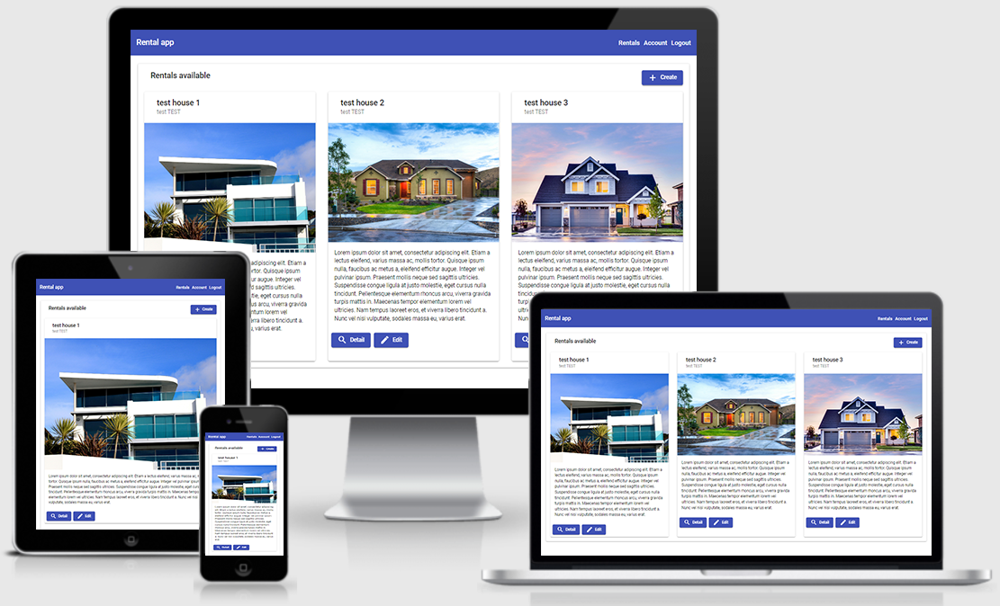

# Projet n°17 : Développer le back-end en utilisant Java et Spring (partie back-end)

## :mag: Aperçu

## :bookmark_tabs: Sommaire

<ol>
    <li><a href="#sujet">Sujet</a></li>
    <li><a href="#demandes_respecter">Demandes à respecter</a></li>
    <li><a href="#objectifs_projet">Objectifs du projet</a></li>
    <li><a href="#technologies_utilisees">Technologies utilisées</a></li>
    <li><a href="#prerequis">Prérequis</a></li>
    <li><a href="#installation">Installation</a></li>
    <li><a href="#utilisation_siteweb">Utilisation du site web</a></li>
    <li><a href="#auteurs_contributeurs">Auteurs et contributeurs</a></li>
    <li><a href="#licence">Licence</a></li>
</ol>

## :page_facing_up: 1. Sujet 

Vous venez de terminer votre précédent projet et vous changez d'équipe pour commencer un nouveau projet, très important pour votre entreprise.

ChâTop veut développer un portail en ligne pour permettre aux locataires potentiels de contacter les propriétaires des différentes propriétés qu'ils souhaitent louer.

## :memo: 2. Demandes à respecter 

- Faire la partie back-end de l'application web en utilisant Java et Spring ;
- Mettre en place une authentification JWT via Spring Security ;
- Mettre en place une base de donnée H2 ;
- L'API doit être documentée avec un Swagger.

## :checkered_flag: 3. Objectifs du projet 

- Apprendre à utiliser Java et Spring (initialisation d'une application Spring, mise en place de JWT, etc...).

## :computer: 4. Technologies utilisées 

- Java
- Spring
- Swagger
- SQL
- Git & GitHub

## :exclamation: 5. Prérequis 

- Avoir fait le necéssaire avec la partie front-end disponible ici :
  https://github.com/LancelleTimote/Projet-n-17-Developper-le-back-end-en-utilisant-Java-et-Spring-partie-front-end
- Vous aurez aussi besoin de maven en version 3.9.8.

## :wrench: 6. Installation 

- Cloner ce repository.
- Pour installer les différents packages, dans le terminal à partir du dossier back-end, exécuter mvn install, ou dans intelliJ faites un build project.

## :question: 7. Utilisation du site web 

- Dans le terminal à partir du dossier back-end, exécuter ChatopApplication présent dans src/main/java/com/chatop ;
- Dans le terminal à partir du dossier front-end, exécuter npm start ;
- L'application est disponible a l'adresse suivante : http://localhost:4200/
- L'API s'exécute sur le port 3001 ;
- Une fois l'API démarré, le Swagger est disponible à cette adresse : http://localhost:3001/swagger-ui/index.html
- La base de donnée H2 est disponible à cette adresse : http://localhost:3001/h2-console
- Les identifiants pour la base de donnée H2 sont :
  Username : sa
  Password : password
- Une fois sur l'application, vous devrez vous créer un compte, voici un exemple de remplissage des champs :
  email : test@test.com
  name : test TEST
  password : test!31
- Important à savoir, au démarrage du serveur, le répertoire d'enregistrement des images pour les rentals et par défaut crée dans C:\uploads

## :beers: 8. Auteurs et Contributeurs 

Timoté Lancelle : [GitHub](https://github.com/LancelleTimote) / [LinkedIn](https://www.linkedin.com/in/timote-lancelle-devweb/)

## :page_with_curl: 9. Licence 

Distribué sous la licence MIT. Voir le fichier [LICENSE](LICENSE) pour plus d'informations.
